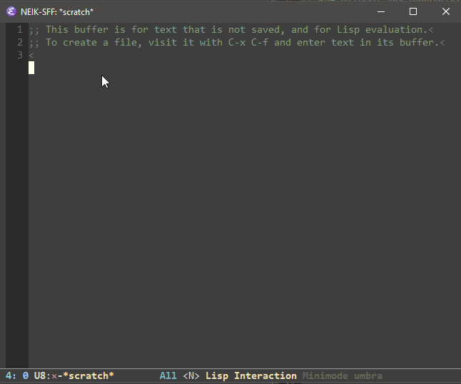

mini-modeline
============

Allows to display mode line information in minibuffer.



# Install
## Using [`Quelpa`](https://framagit.org/steckerhalter/quelpa)

Example:

``` elisp
;; I'm activating mini-modeline after smart-mode-line
(use-package mini-modeline
  :quelpa (mini-modeline :repo "kiennq/emacs-mini-modeline" :fetcher github)
  :after smart-mode-line
  :config
  (mini-modeline-mode t))
```

Although I would recommend my `Quelpa` [fork](https://github.com/kiennq/quelpa) since it allows to shallow clone git repo and can run on Windows 10 with buit-in `tar`.

## Manually
Just clone this repo and put it in your `load-path`.

# Usage
`mini-modeline` comes with a global minor-mode `mini-modeline-mode`.
You can toggle it by `M-x mini-modeline-mode`.

## Important variables
You can customize those variable for better experiences.

1. `mini-modeline-format`
    Analogous to `mode-line-format`, but controls the minibuffer line.

2. `mini-modeline-color`
   Background of mini-modeline. Will be set if `mini-modeline-enhance-visual` is t.

3. `mini-modeline-enhance-visual`
   Enhance minibuffer and window's visibility. This will enable `window-divider-mode` since without the mode line, two continuous windows are nearly indistinguishable.

4. `mini-modeline-echo-duration`
   Duration to keep display echo. `mini-modeline` will display the message which has been echoed to echo area as part of mode line. Those echo will be automatically clear after this interval.
   Check out the gif to see it in action.

5. `mini-modeline-update-interval`
    The minimum interval to update `mini-modeline`.
   If you found `mini-modeline` is being updated to frequently, you can customize this variable.

# Why?

Echo area or `minibuffer` which reside in it is a big waste most of the time.
It's empty (mostly) and unnecessarily consume an additional line of your editor.
Look at `VsCode`, it has only one line at the bottom to display the status, even more, its message can even be nicely integrated into the status line.
**That's the sleak UI that I want for my editor.**

At first, I've tried to hide `minibuffer` and only raise it when needed.
Those efforts not bode well, even when the `minibuffer` is displayed in separate frame, it stil has title bar, which is ugly since the `minibuffer` is just one line.
Trying to display `minibuffer` in mini frame is not working well too. Well, I've never succeeded at that.

Then, finally another idea comes, if I cannot hide the `minibuffer`, I can just hide the `mode-line`, and display its information in `minibuffer` instead.
Hence that why this package is born.
